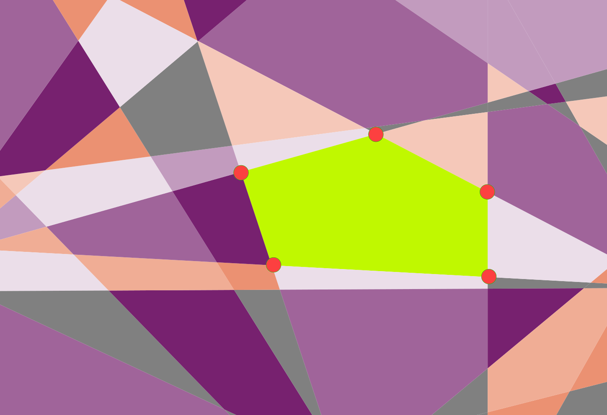
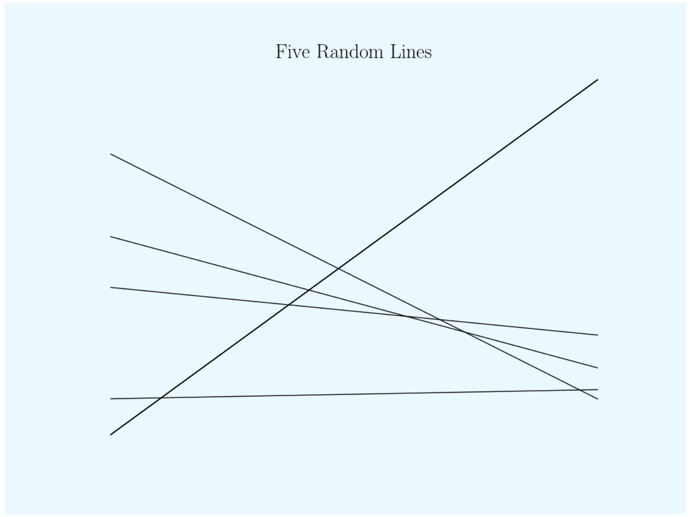

# Geogeometry


Answering: average number of sides for closed polygons made from 10 randomly drawn lines on a sheet of paper?

The answer to this question suggests fundamental laws about the geometry of geology. For example, the distinct features of cracked mud or broken rocks. The lines used in this analysis represent lines of tension which generate fracturing. By knowing the average number of edges for a specific geological formation we can work backwards to learn about the topology (e.g. the internal and external stresses, material properties).

Inspired by the Quanta article ["Scientists Uncover the Universal Geometry of Geology"](https://www.quantamagazine.org/geometry-reveals-how-the-world-is-assembled-from-cubes-20201119/)

# Quick Start
Put `geogeometry.py` and `test_basic.py` in same folder. Run test from command line as
```bash
$ python test_basic.py
```

# Summary

According to the Quanta article the average number of sides should be 6. This simulation calculates the average by counting the number of edges for a given number of lines drawn (e.g. draw 2 lines, 3 lines, ..., N lines) then averages the array of edge counts. 
```python
Mean:  6.597915891328619
Max:  15
Mode:  6
Median:  6.0
```
The example above looped from 2 lines to 10 lines. 

An interesting analysis is to look at the number of intersections as a function of lines drawn. 


**Further analysis should be explored in the future!**

# Notes 
 * half of the lines are drawn horizontally and half vertically. This guarantees line intersections
 * each line is drawn by randomly selecting a point on each opposing boundary (e.g. left/right [horizontal] or bottom/top [vertical])

# Future Work
 * extend the *no. intersections vs. no. lines* to a much larger number (e.g. 100)
 * calculate *no. mosaics vs no. lines*
 * calculate *area vs. no. lines*
  * expect this area to plateau; this should be number of lines drawn, $N_0$
 * repeat mosaic simulation using $10k$ iterations of $N_0$ lines drawn
 * map from flat surface to generalized geometry
  
